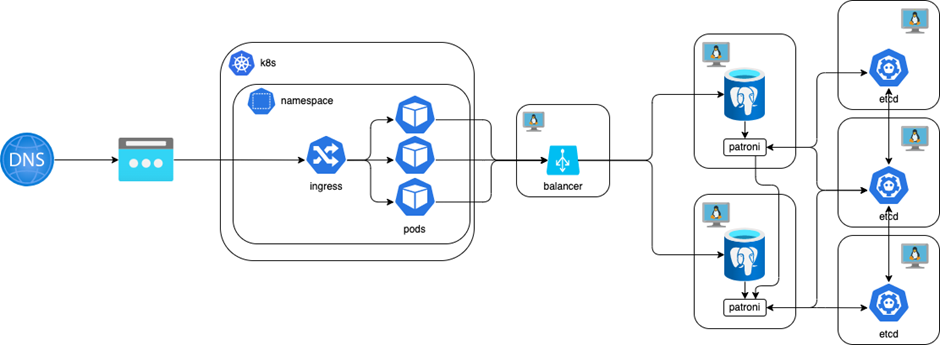
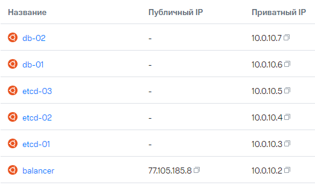

## SRE-Course (Module 2)


### Состав репозитория

- helm-student23.zip  - Архив helm-чарта, с настроенным template деплоя
- ansible-student23.zip - Архив ansible playbook, с настроенной ролью
- readme.md - Этот файл

### Описание

Репозиторий содержит ansible playbook, helm chart, развертывающие приложение в следующей архитектуре:


Приложение (application) располагается в k8s кластере, в выделенном неймспейсе. База данных реализована как кластер PostgreSql на основе Patroni (2 БД, 3 etcd) с инстансом Haproxy в качестве точки входа

### Инфраструктура

Развернуты следующие виртуальные машины:


Кластер k8s **"grand-lion-d99896"** - коммунальный, ip адрес внешний одинаковый для всех. Разделение запросов осуществляется через доменное имя **"weather-api.sre-course-student23.example"**

### Порядок действий

1. Распаковать и выполнить ansible playbook для развертывания etcd, patroni, postgres и единственного инстанса Haproxy
2. Выполнить скрипт создания БД 

```sql
create table if not exists public.cities
(
	id bigserial,
	name varchar(255)
);

create table if not exists public.forecast
(
	id bigserial,
	"cityId" bigint,
	"dataTime" bigint,
	temperature integer,
	summary text
)`
```

3. Распаковать и выполнить helm chart для разворачивания api в выделенном неймспейсе **namespace: sre-cource-student-23** 
Перед выполнением удостовриться, что версия API последняя **https://github.com/LdEsT/SreCourseApi/pkgs/container/sre-course%2Fapi**
4. Проверить работоспособность


### Enjoy!

